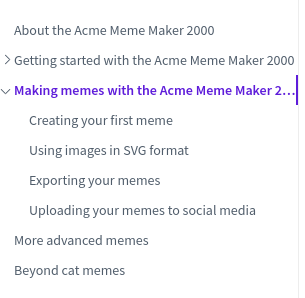

# Organizing MDITA topics with XDITA maps

Maps in Lightweight DITA provide a relationship structure for your topics \(rather like a table of contents\), and also provide a processing context for resuable content.

If you are used to publishing your Markdown content using a static site generator \(SSG\), you probably use an SSG file to give a navigation order to your Markdown files. A map in LwDITA does exactly the same thing, and when built, the map is outputted as a file \(index.md\) that can be used by some SSGs as a navigation TOC.

XDITA maps use the `.ditamap` file extension.

A simple XDITA map for Acme Meme Maker 2000 - a software product for people with way to much time on their hands:

```
<?xml version="1.0" encoding="UTF-8"?>
<!DOCTYPE map PUBLIC "-//OASIS//DTD XDITA Map//EN" "map.dtd">
<map id="mememaker-map">
    <topicref href="about.md" format="markdown"/>
    <topicref href="get-started.md" format="markdown">
        <topicref href="sys-reqs.md" format="markdown"/>
        <topicref href="install.md" format="markdown"/>
        <topicref href="update.md" format="markdown"/>
        <topicref href="uninstall.md" format="markdown"/>         
    </topicref>
    <topicref href="making-memes.md" format="markdown">
        <topicref href="create-meme.md" format="markdown"/>
        <topicref href="use-svg.md" format="markdown"/>
        <topicref href="export-formats.md" format="markdown"/>
        <topicref href="upload.md" format="markdown"/>
    </topicref>       
        <topicref href="advanced-memes.ditamap" format="ditamap"/>
</map>
```

Let's break it down for the benefit of folks with no XML experience. The first two lines contain the XML and Doctype decalarations:

```
<?xml version="1.0" encoding="UTF-8"?>
<!DOCTYPE map PUBLIC "-//OASIS//DTD XDITA Map//EN" "map.dtd">
```

These contain information used by the XML parser in your editor and the DITA Open Toolkit. Every XDITA map must begin with these two lines but, other than ensuring that, you don't need to worry about them.

Next comes the `<map>` element \(or "tag"\). The `<map>` element is a container for all the other elements in the map. it is usually a good idea to apply an `id` attribute to the map tag to differentiate it from any other maps you use.

```
<map id="mememaker-map">

...

</map>
```

Nested within the `<map>` element in our example are `<topicref>` \(topic reference\) elements. The `<topicref>` element, as the name suggests, refers to a topic.

```
<topicref href="about.md" format="markdown"/>

...

<topicref href="advanced-memes.ditamap" format="ditamap"/>
```

The `href` attribute is used to indicate the path to the topic relative to the map file. In this case, the topics are all in the same folder as the map.

The `format` attribute is used by the DITA-OT during processing. For MDITA files there are two `format` attribute values you can set: `markdown` or `mdita`. If you apply `format="markdown"`, the DITA-OT knows that the file contains "extended profile MDITA". Extended profile MDITA can incorporate extensions from Markdown Extra \(definition lists and footnotes\), Pandoc \(YAML front-matter headers\) and HDITA element types. If you apply `format="mdita"`, the DITA-OT knows that the content is 'core profile MDITA' which aligns more strictly with GitHub-flavored Markdown. To take fuller advantage of the content reuse features of MDITA, using extended profile MDITA is strongly recommended. See [MDITA topics](MDITA-topics.md) for a fuller discussion of extended profile MDITA.

You can also nest other XDITA maps within a map using `format="ditamap"`. A map that contains other maps is known as a *root map*. A map contained within another map is called a *submap*.

The order that `topicref` elements appear top-to-bottom defines the order that topics will be presented in your document. You can also nest `topicref` elements within another `topicref` element. Nesting is useful for gathering topics that share a general theme. In a navigation sidebar on a documentation website, nested topics appear at a lower level than their parent.

The Acme Meme Maker 2000 map converted to a navigation sidebar TOC in Docsify: 

There are a few more XDITA map elements and attributes than shown here, some of which we will explore in [Using keys with MDITA](MDITA-keys.md). For a comprehensive list, see the [Lightweight DITA Specification](https://www.oasis-open.org/committees/download.php/65658/lwdita.pdf).

